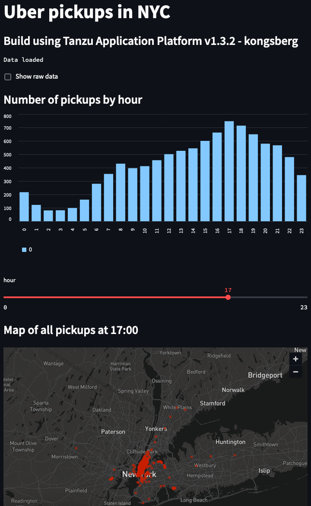

# Python Demo app

This demo app is showing Uber pickups in New York City!

It's based on the Python module Streamlit, and is part of their demo applications.
It a simple application, showing Uber pickups, in New Yoyk City.

All data, da be manupulated, using sliders, and it's also possible to see the raw data.

